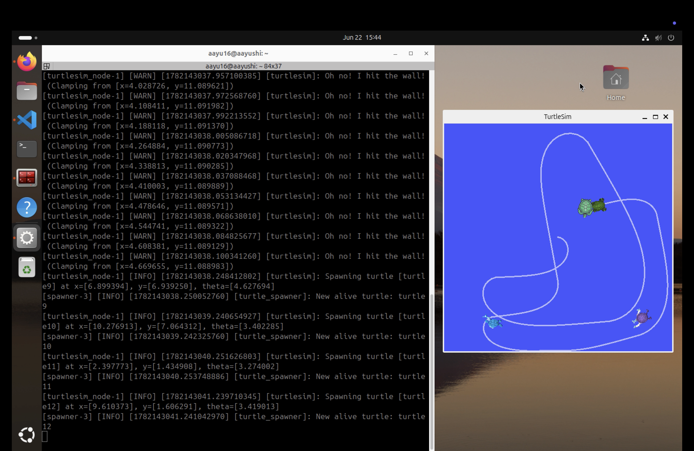

# ROS 2 Turtlesim – Catch Them All

## Overview

This project is an autonomous turtle-catching application developed using ROS 2 and the Turtlesim simulator.

A main turtle continuously identifies and pursues the **closest spawned turtle**, catches it, and then proceeds to the next nearest target until all turtles have been removed. The project demonstrates practical ROS 2 concepts including node communication, publishers, subscribers, services, custom interfaces, and launch file management.

The entire project was developed and tested in a **Ubuntu environment running on UTM virtualization**.

---

## Features

* Autonomous turtle navigation
* Random turtle spawning
* Nearest-target selection strategy
* Automatic turtle elimination after capture
* ROS 2 launch file integration
* Modular node-based architecture
* Real-time movement control

---

## Technologies Used

* ROS 2
* Python (rclpy)
* Turtlesim
* Ubuntu on UTM
* Git & GitHub

---

## Project Workflow

1. The system spawns turtles at random positions within the Turtlesim environment.
2. The main turtle continuously monitors all available targets.
3. The closest turtle is selected as the current target.
4. Velocity commands are generated to navigate toward the target.
5. Once the turtle is within the capture threshold, the target turtle is removed.
6. The process repeats until all spawned turtles have been caught.

This nearest-target approach improves efficiency by minimizing unnecessary travel distance.

---

## Project Structure

```text
turtlesim_catch_them_all/
├── turtlesim_catch_them_all/
│   ├── turtle_controller.py
│   ├── turtle_spawner.py
│   └── __init__.py
├── package.xml
├── setup.py
├── setup.cfg
my_robot_interfaces/
├──msg
│   ├──Turtle.msg
│   └──TurtleArray.msg
├──srv
│  └──CatchTurtle.srv
├──CMakeLists.txt
├──package.xml
my_robot_bringup/
├──launch/
│   └──turtlesim_catch_them_all.launch.yaml
├──config/
│   └──catch_them_all_config.yaml
├──package.xml
├──CMakeLists.txt
README.md
```

---

## ROS 2 Concepts Demonstrated

* ROS 2 Nodes
* Publishers
* Subscribers
* Services
* Custom Messages
* Timers
* Launch Files
* Package Creation
* Topic Communication

---

## Installation

Clone the repository into your ROS 2 workspace:

```bash
git clone https://github.com/YOUR_USERNAME/ros2-turtlesim-catch-them-all.git
```

Build the workspace:

```bash
colcon build
```

Source the workspace:

```bash
source install/setup.bash
```

---

## Running the Project

Launch the complete application using:

```bash
ros2 launch catch_them_all catch_them_all.launch.py
```

The launch file automatically starts all required nodes and simplifies project execution.

---

## Demo


---

## Learning Outcomes

Through this project, I gained practical experience with:

* ROS 2 package development
* Node communication and coordination
* Autonomous robot control
* Target selection algorithms
* Service-based interactions
* Launch file creation and management
* Debugging and testing ROS 2 applications

---

## Development Environment

* Ubuntu (UTM Virtual Machine)
* ROS 2
* Python 3
* Turtlesim Simulator

---

## Future Improvements

* Advanced path-planning algorithms
* Obstacle avoidance
* Multi-turtle cooperation
* Performance analytics
* Dynamic target prioritization

---
